# C4 Architecture

- Status: Target architecture and staged implementation plan accepted 2026-07-13
- Updated: 2026-07-13
- Product: Bazaar Guru
- Notation: Mermaid flowcharts using C4 person, system, container, and component
  boundaries.

Target architecture appears first. Legacy system appears only in appendix and
must not be mistaken for desired product.

## Target: Level 1 System Context

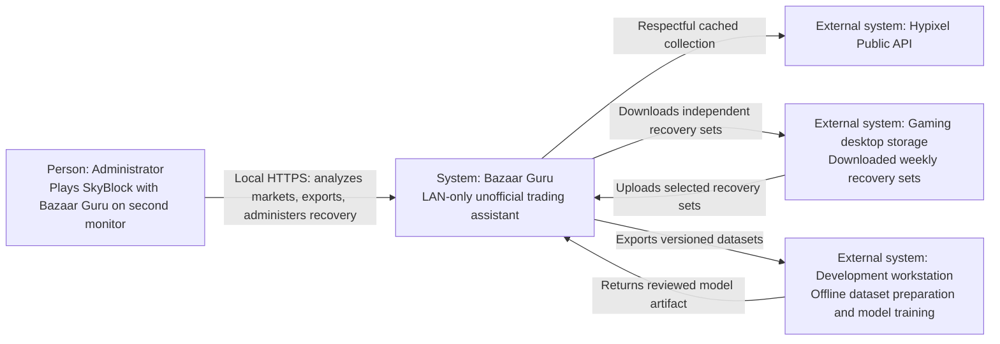

## Target: Level 2 Containers

This view contains two PostgreSQL containers by explicit user decision.

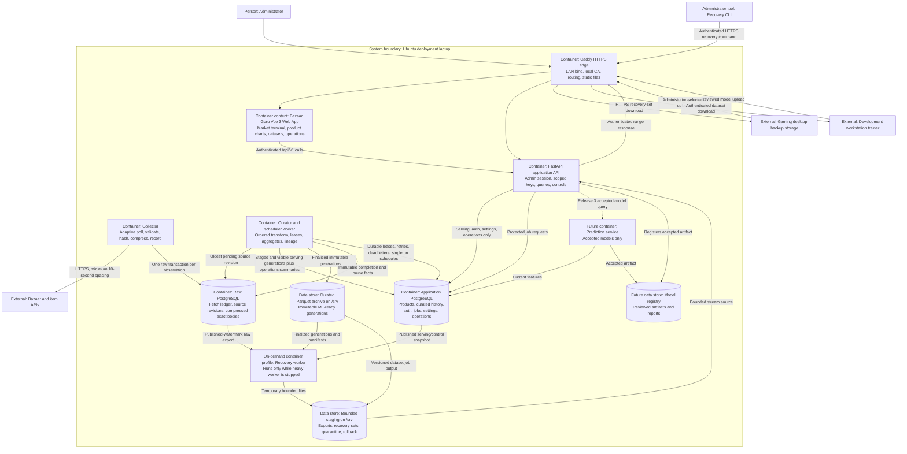

## Target: Raw Collection Components

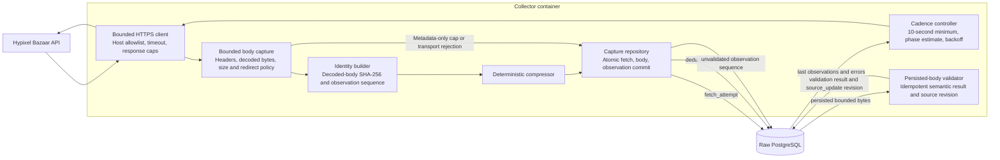

Initial Raw PostgreSQL transaction records attempt metadata, body identity,
compressed exact decoded entity bytes, and observation sequence. Validator reads
only persisted bytes, then writes semantic result and source revision in a
separate idempotent transaction. Parser failure cannot lose captured body. Every
bounded received body is captured before semantic validation, including malformed
or schema-changing JSON. Body omission is allowed only when transport produces
none or configured cap rejects it, with rejection metadata retained. Same
`lastUpdated` with changed body hash becomes a new revision.

## Target: Curation and Two-Database Consistency

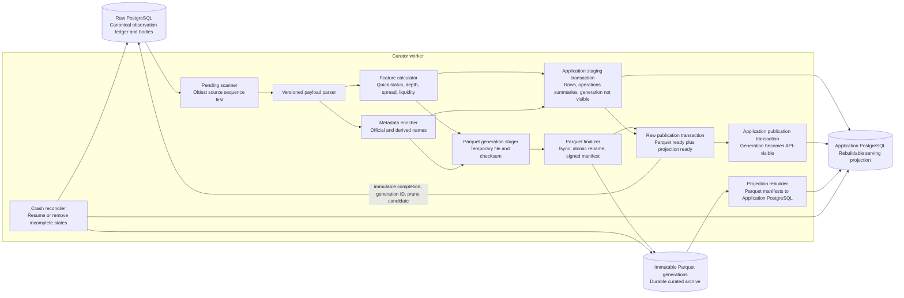

No distributed transaction is claimed. Saga states are `captured`,
`parquet_ready`, `projection_ready`, `raw_published`, and `app_visible`. API
queries only Application generations marked visible in one transaction. Curator
projects gap, failure, lag, and high-watermark summaries into Application
PostgreSQL while immutable completion/prune facts remain in Raw PostgreSQL.
Reconciliation tests every crash boundary. Parquet manifests contain every field
needed to rebuild Application projections after raw pruning. Raw data becomes
prune-eligible only after `app_visible` and rebuild verification.

## Target: Web, API, and Forecast Components

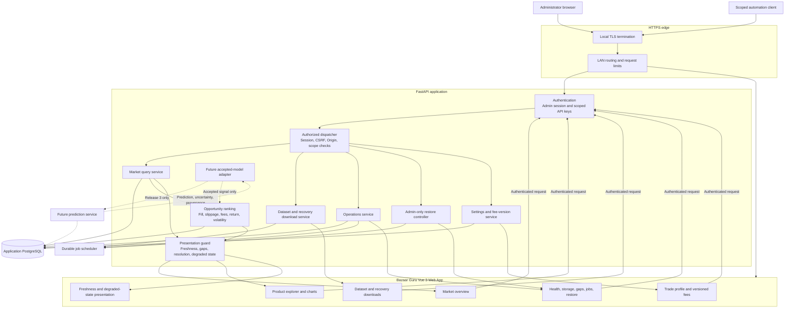

The webpage is a first-class Vue application, not Adminer or generated API docs.
Forecast output cannot bypass transparent non-model score components or freshness
guards.

## Target: Backup and Restore Components

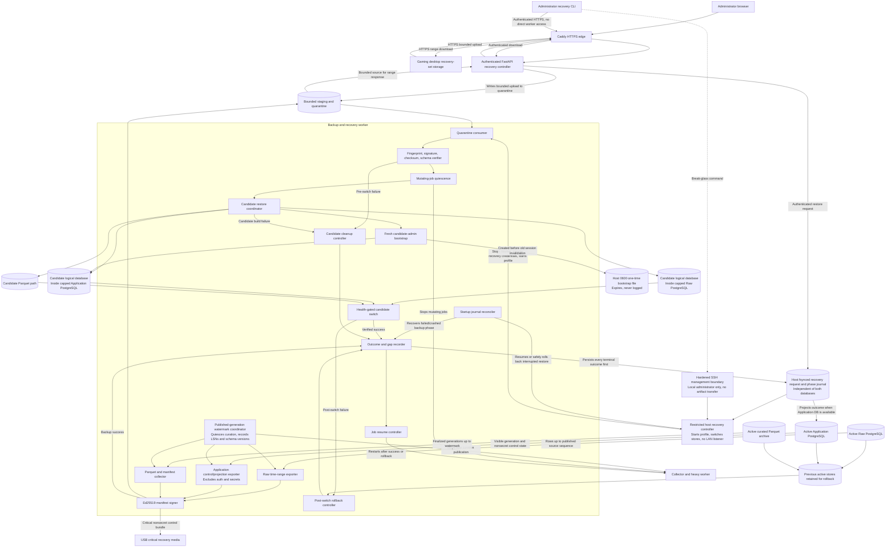

Weekly recovery sets are independent UTC time ranges, not delta chains. Restore
can apply any complete set; missing sets become explicit gaps. Bundle-supplied
verification keys are ignored in favor of release-pinned fingerprint metadata.
Candidate stores are built and verified before switch. A failed candidate leaves
active stores and existing auth untouched; only a successful candidate receives
fresh bootstrap auth because backups exclude credentials. Candidate databases
are logical databases inside existing capped PostgreSQL containers, not two more
processes. Host journal, not Application PostgreSQL, is restore orchestration
authority. Every backup/restore success, failure, or recovered crash reaches
Audit and Resume. After successful switch, administrator retrieves one-time
bootstrap secret through protected host-local SSH path and rotates it immediately.

## Target: Deployment View

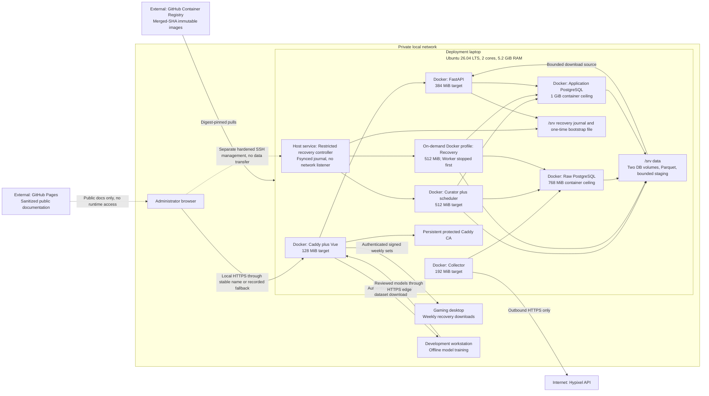

The two PostgreSQL containers are explicitly bounded. Normal container ceilings
total about 3 GiB, preserving host/filesystem-cache headroom; swap is not counted
as safe working memory. Host deployment controller stops Worker before starting
the on-demand Recovery profile and mounts recovery credentials only there. No
application container receives Docker socket access.

## Target Trust Boundaries

- Hypixel responses are untrusted external input.
- LAN access does not replace authentication or HTTPS.
- Caddy is the only inbound application/data edge. Hardened SSH is a separate
  administrator management boundary used for deployment and break-glass commands
  only; recovery artifacts never transfer through SSH.
- Recovery worker and storage expose no LAN listener; download/upload/model/data
  transfers cross Caddy and authenticated API.
- API can access Application PostgreSQL, never Raw PostgreSQL or Docker socket.
- Collector can write Raw PostgreSQL, never Application PostgreSQL.
- Curator has least-privilege access to both databases and Parquet output.
- Recovery receives elevated database/storage access only during guarded jobs.
- Restricted host recovery controller has no network listener, owns fsynced
  journal/start-stop/switch operations, and never enters application containers.
- Backups exclude credentials, sessions, API keys, admin hashes, private keys,
  host access details, and personal settings.
- Model artifacts remain untrusted until Release 2 review accepts them.

## Legacy Appendix: Current System Context

Legacy diagrams explain rescue origin only. Legacy system has no product webpage.

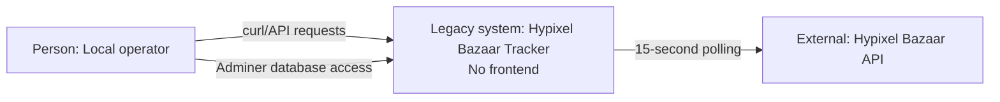

## Legacy Appendix: Current Containers

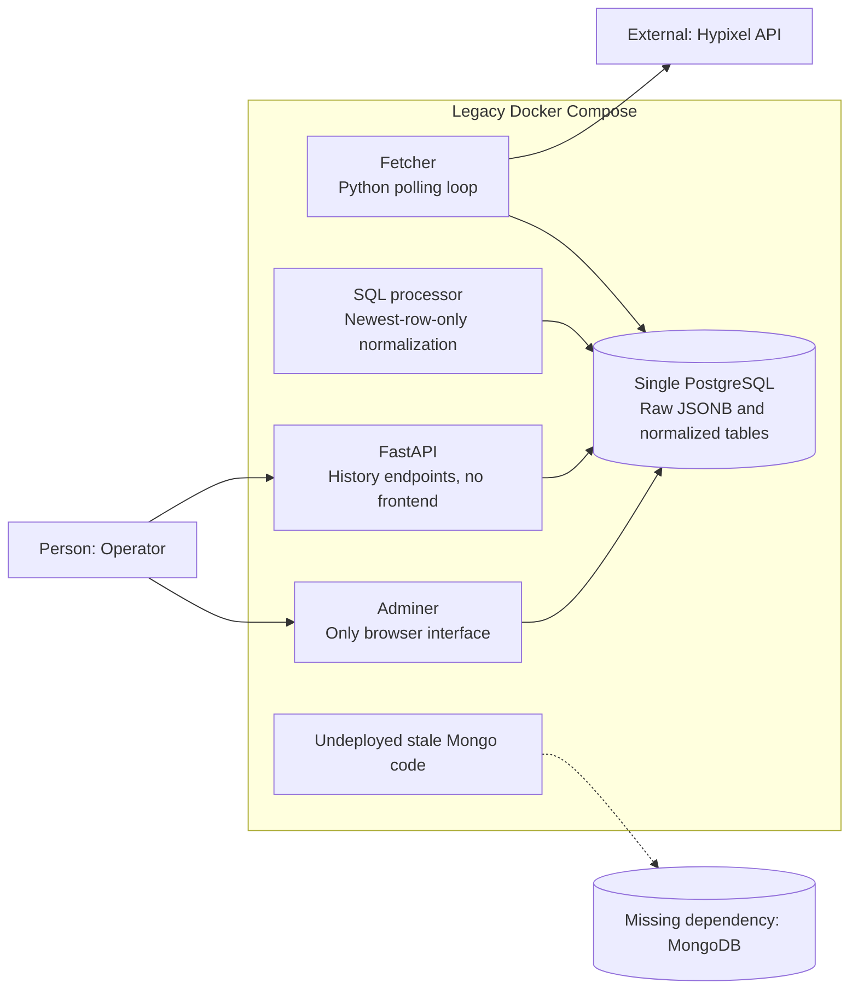

## Legacy Appendix: Current Components

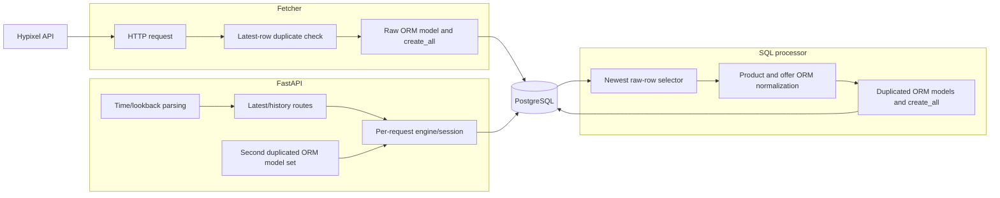

## Legacy Appendix: Current Deployment

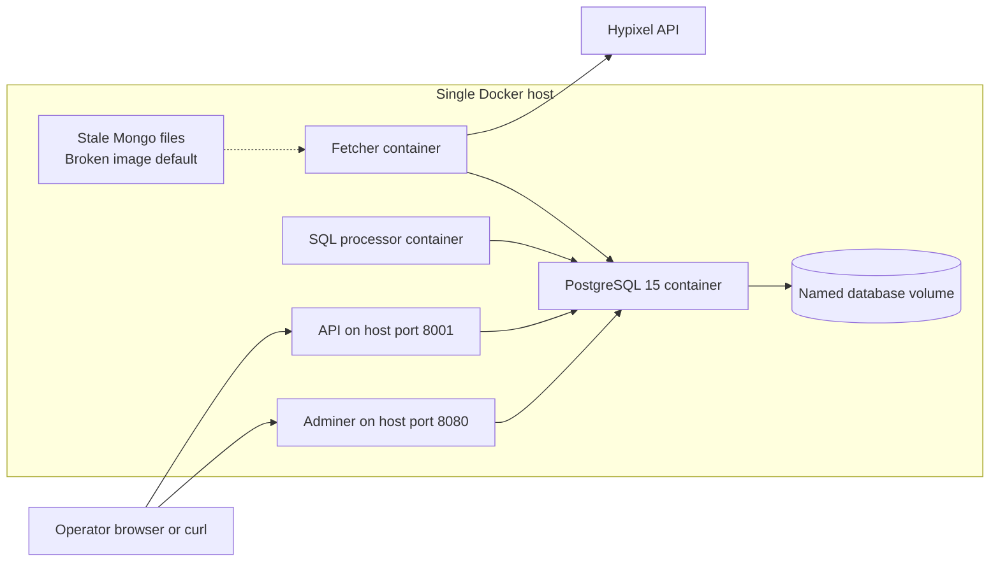

## Architecture Update Rule

Update C4, SRS, ADRs, migrations, and traceability together whenever accepted
work changes containers, databases, authority, trust boundaries, deployment, or
release ownership.
